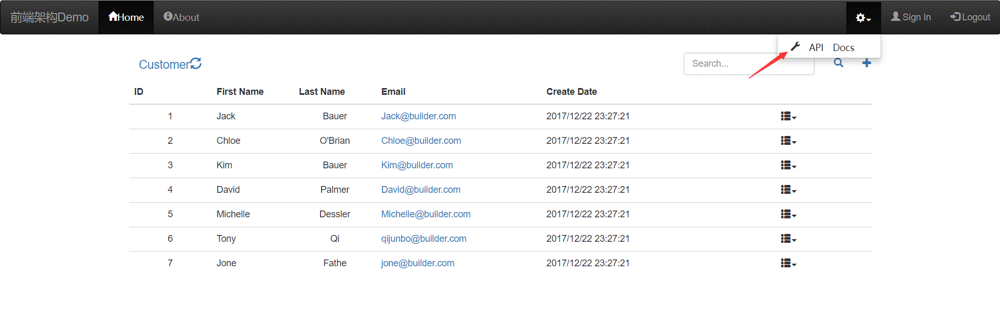

Quick Start Swagger 
==

实现 Swagger UI 和项目的集成有两种方法. 

- [swagger-springmvc](https://github.com/qijunbo/swagger-demo)
- springfox-swagger2 (本方法)

How do I get set up? 
--

* import the required jar package in [build.gradle](https://github.com/qijunbo/swagger-demo/blob/master/build.gradle), 
if you use spring-boot, things can be very easy.  this package is the only thing you need.
but if not,  you can refer to the reference link at the bottom of this page.
```
//-- Swagger2-config    
compile("io.springfox:springfox-swagger2:2.7.0")
compile("io.springfox:springfox-swagger-ui:2.7.0")
//-- Swagger2-config-end
```
* Copy the [SwaggerConfig.java](https://github.com/qijunbo/swagger-demo/blob/master/src/main/java/com/example/SwaggerConfig.java) in your project. 

Customize the package path like this:
   
```
@Bean
public Docket api() {
	//@formatter:off
	return new Docket(DocumentationType.SWAGGER_2)
			.select()
			.apis(RequestHandlerSelectors.basePackage("com.example.jpa.resource"))
			//.paths(PathSelectors.ant("/api/*"))
			.paths(PathSelectors.any())
			.build().apiInfo(apiInfo());
	//@formatter:on
}

```

* (Optional)Customize the output. you can ignore this step if you don't want to waste time on this.  That is to say, if you don't want to use ``` @ApiOperation(value = "Add Customer", httpMethod = "POST", response = Customer.class, notes = "Add Customer") ```,  swagger-ui can also works well.

```
    @RequestMapping(method = POST)
    @ApiOperation(value = "Add Customer", httpMethod = "POST", 
           response = Customer.class, notes = "Add Customer")
    public @ResponseBody Customer create(
                @ApiParam(required = true, name = "requestbody", value = "Customer data in json format.")
                @RequestBody 
                Customer customer) {
        customer = repository.save(customer);
        return customer;
    }

```    

* Build this project with gradle and run. 

```
gradlew  eclipse clean  build
java -jar  build/libs/customer.jar
```
* Verify

 http://localhost/v2/api-docs
 

 

* Done

 http://localhost
 
 http://localhost/swagger-ui.html


Who do I talk to? 
--
junboqi@foxmail.com

知识拓展
--

本程序还可以以Docker镜像的形式发布, 具体可参考[README](docker/README.md)


Reference
--
本文主要参考下面的链接, 但是由于这些参考资料用的版本比较老, 本文做了调整.

http://www.baeldung.com/swagger-2-documentation-for-spring-rest-api

http://blog.csdn.net/zhaky/article/details/64906686

